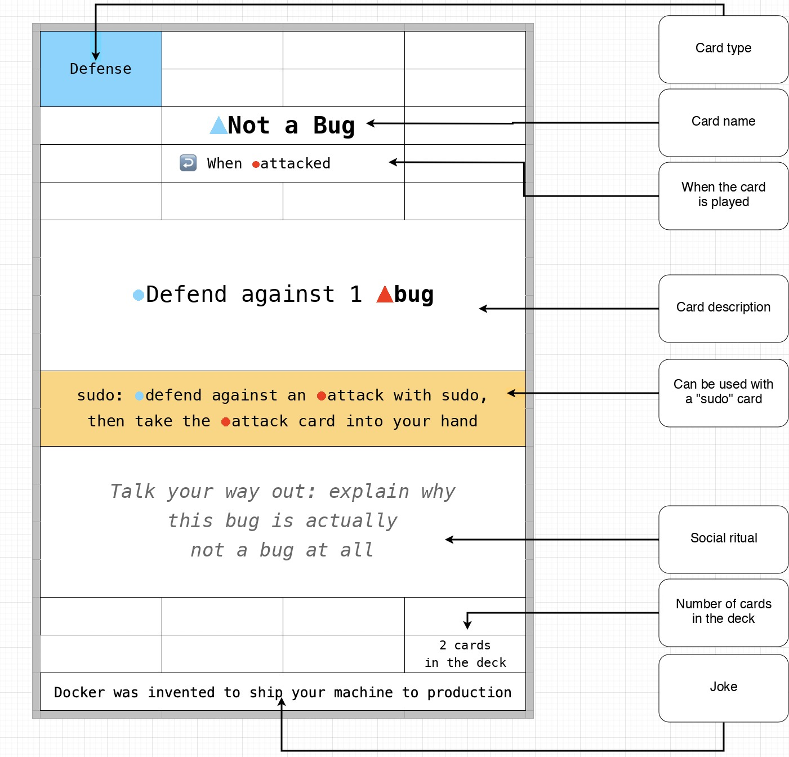
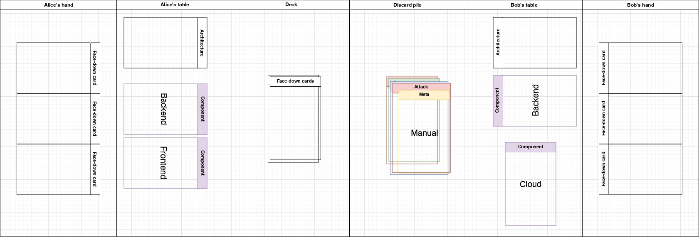

# Ship IT!

A game for 2 to 5 players, 30 to 45 minutes, ages 16+

A humorous game for people who love IT.
Be the first to deploy all the components of your architecture to production and beat your competitors!
And just like in real life, you have to: nitpick and cancel your colleagues, keep an eye on your infrastructure and never deploy on a Friday, use `sudo`, burn out and steal, find bugs and vulnerabilities in other people's applications. A game with serious consequences!

The goal of the game is to build a project out of components that matches a given architecture. Players lay components out on the table in front of them. Other players can attack them to slow you down. Defend against their attacks and attack them yourself. Draw cards and use special abilities to bring your victory closer. Beware of legacy and Fridays!

> **Note on card names:** the physical cards are currently printed in Russian.
> Card names in this translation are given in English, with the original Russian name in parentheses on first mention.
> See the [card reference](cards.md) for an English translation of every card.

Questions or suggestions about the game?
Join our chat:

We also have a bot, "Ship IT Rules CTO", that can help with the rules and explain what to do in any given situation: https://chatgpt.com/g/g-NivGnZ2kM-ship-it-rules-cto

## Cards

There are the following card types:
- Architecture (white) – your objective for the game, needed to win
- Components (purple) – your application is built from these; they power up cards marked with ⚙️
- Draw (green) – take more cards
- Attack (red) – break and steal your opponents' components
- Defense (blue) – protect yourself from attacks
- sudo (gold) – powers up some cards
- Meta (brown) – special abilities that affect the course of the game
- Legacy (light gray) – cards you'd rather not take from other players
- Events (dark gray) – random occurrences that immediately affect the game

Symbols:
- ↩️ – reaction (can be played outside of your turn)
- ▲ – bug
- ɷ – vulnerability
- 👥 – players
- ⚙️ – you have a component on the table
- 🚧 – block: this type of component cannot be played
- 🪟 – special modifier for [hard mode](#hard-mode)

## Setup

If you are playing for the first time, take a look at the rules for [Tutorial mode](#tutorial-mode). It is perfect for getting to know the game!

1. Deal the "Architecture" cards

Each player is dealt a random "Architecture" card face down to learn their win condition: which components they will need to lay out on the table. This is your objective for the game.

Place this card face down next to you.
Since every player has a different objective, nobody knows in advance which components you need to win. That is something to figure out as the game goes on.

You will need your Architecture card at the end to confirm your victory.

2. Remove extra component cards

The number of each of the "Database" ("База данных"), "Backend" ("Бекенд"), and "Frontend" ("Фронтенд") cards must equal the number of players. If there are fewer than 5 players, remove the extra cards.

For example: if there are three of you, keep three each of "Database", "Backend", and "Frontend".

3. Deal the rest of the cards

- With 2 players: each takes 6 cards
- With 3, 4, or 5 players: each takes 7 cards

4. Discard events at the start of the game

If you were dealt event cards, shove them somewhere into the middle of the deck.
Draw new cards in their place. Repeat if necessary.
The initial deal is the *only* time event cards are not resolved.

## Gameplay

The winner of the previous game, or whoever dealt the cards this time, goes first. Play then proceeds clockwise.

### Start of the turn

The first thing you *must* do is draw a card from the deck.

If a player does not draw a card from the deck as their *first action*, whoever notices it first may pull a random card out of that player's hand as a penalty. The player cannot then draw the card from the deck *retroactively*.

*You cannot lay out a winning component* without drawing a card from the deck at the start of your turn. There might be an interesting event in there. Watch out for cheaters and punish them by pulling a card from their hand!

If you have no cards in your hand at the start of your turn, you may draw 5 cards from the deck instead of the standard 1. You resolve all events as usual.

### Taking actions

On your turn you can:
- Play 1 component card: lay it out on the table, or return it to the deck in exchange for other cards
- Play any number of other cards
- If you have not played any cards this turn, you can always skip your turn and draw one extra card. Event cards and reactions do not count as playing cards.

Actions can be taken in any order.
For example:
1. Play attack cards
2. Get a component from an opponent
3. Lay a component out on the table

If the deck runs out during your turn, shuffle the discard pile and use it.

Hand limit: if you have more than *8 game cards* at the end of your turn, discard the excess. White "Architecture" cards do not count.

## Components

If you have components laid out on the table, some cards become stronger for you.
Some card descriptions contain the ⚙️ symbol, which shows which effects are powered up if you have at least one component of any kind on the table.

For example, the "OpenSource" card lets you take from the shared pile:
- 1 card, if you have no components on the table
- ⚙️2 cards, if you have a component on the table

It pays to lay components out on the table as early as possible.

## Events

Unexpected events in the IT world are only ever negative.

During the initial deal, event cards in hand are exchanged for other cards.

If you draw a black event card from the deck or receive one some other way (for example, via "OpenSource" with "sudo"), you play it immediately on your turn.

If you receive an event card outside of your turn, the event card stays on the table in front of you until your turn. On your turn you must resolve it as your very first action, even before drawing a card.

## Attack

You don't want your opponents to win before you do, do you?!

There are two types of attack in the game:
- Bugs of several kinds (result: the opponent loses a component from the table)
- Vulnerabilities of several kinds (result: the opponent gives a component from the table to your hand)

How does an attack work?

No more than two players take part in an attack: the attacker and the defender.

If you play an attack card against a player, they will have to either defend themselves or fulfill the condition written on the attack card. For example: return a component to their hand or to the discard pile, or give the component to the attacker.

By the way, if you returned your component from the table to your hand, that component is under a 🚧 block: you can only play that *type of component* (for example, all "Frontend" cards) after the specified number of turns (while your engineers fix it!)

### Defense

Use reaction cards ↩️ ("Not a Bug" ("Отговорка"), "Patch" ("Патч"), "Crutches" ("Костыли")) to defend against different types of attacks!
You also have "sudo" cards to power up both attack and defense.

For details, see the [FAQ](faq.md#how-do-attack-cards-work)!

## Social rituals

Some cards have a special condition (see the "social ritual" example in the picture above). These rituals must be performed when the card is played. It *must* be performed before your next action this turn. If a player forgets, can't, or doesn't want to perform it, the first player to notice the violation may pull a random card out of their hand.

The effect of the played card is not cancelled.

The Meta card "Manual" adds even more chaos, since it lets you invent unique social rituals for different actions. The rules are the same: if you get caught not performing a social ritual, a card gets pulled from your hand!

If you did something against the rules and nobody noticed while it was being played, then so be it. You have to pay attention to the game! But if someone notices before the next game action, the action is cancelled and you are punished the same way: a card is pulled from your hand.

## Victory

If at the end of your turn you have the set of components on the table that your "Architecture" card requires, congratulations, you've won! Show your "Architecture" card to everyone else.

You can keep playing until only one loser remains. Players who have won drop out and discard their cards.
The loser deals the cards next time, and the winners may call them "Junior" for the whole next game.

If a game is interrupted before it ends, the official winner is the player who has the project on GitHub with the most stars.

## Game variants

Tips for picking a mode:
- First 1–2 games: "Tutorial" mode
- Games 3–4: regular mode, without any changes
- After that: hard mode

### Tutorial mode

This mode is for you if you are playing for the first time.
It will help you understand the game and get through your first game quickly.

There are only a few changes:
- Always deal 5 cards at the very start
- You can play only 3 cards per turn (including 1 component)
- No hand limit
- All component cards always stay in the deck (don't remove the extra ones)

We don't recommend playing this mode for more than two games. Move on to the regular mode and hard mode as soon as you can to get the most out of the game!

### Freelance mode

An optional rule that changes when and how "Architecture" cards are given out.

Changes:
- "Architecture" cards are no longer dealt randomly at the start of the game
- Now you have to bid for "Architecture" cards
- Before the game starts, after the black cards from the deal have been replaced, each player may return several cards to the deck, in normal turn order
- The maximum number of cards that can be returned to the deck equals the number of players
- Players choose "Architecture" cards from all those available, without showing their choice to others, in order from the player who returned the most cards to the player who returned the fewest
- If two or more players returned the same number of cards, the order is resolved further: the tied players each take a free "Architecture" card, and whoever has the higher "Task" number on the card chooses first. The "Architecture" cards used for the tie-break are returned to the shared pile

Do not play this mode together with "Tutorial" mode.

### Hard mode

> **Translator's note:** in Russian this is the "душный" ("stuffy") mode.
> "Stuffy" is Russian slang for an annoying nitpicker, hence the 🪟 window symbol.

If you have played the game several times already, have read all the rules at least once, and are ready for new adventures, there are special hard mode rules for you: you may pull a random card from a player's hand for any slip-up they make.

You must also carefully watch for the special hard mode modifiers on the cards: the 🪟 symbol (somebody open a window already! it's so stuffy in here!)

These actions must additionally be acted out when the card is played. They supplement the existing social rituals on the cards. In regular mode they mean nothing.

An incomplete list of punishable mistakes. You must not:
- stall for too long during your turn
- not know whose turn it is
- look at your phone during the game, get distracted
- step away from the game table
- drop or damage cards
- act out a social ritual insufficiently (a "Cancel" ("Отмена") that isn't dramatic enough, a "Burnout" ("Выгорание") that isn't toxic enough)
- act out hard mode 🪟 modifiers insufficiently
- wrongly call out a social ritual as not performed (when the player did perform it, or didn't have to)
- get minor details of the rules wrong
- draw too many or too few cards when drawing
- not draw a card at the start of your turn (same as in regular mode)
- draw two cards at the start of your turn and keep playing
- try to play a second component in one turn
- try to lay out a 🚧 blocked component type
- touch your own or someone else's "Cloud" for no reason while it's on the table
- take someone else's components during an attack too early
- not show the card when playing the "Garbage Collector" ("Сборщик мусора") card
- exchange cards face down during "Handshake"
- stack the discard pile face down

And any other rules you find nitpicky and fun enough for your group.

### House rules

We also have a [special section](homebrew.md) for "house" (or "homebrew") variants of the game rules. If you came up with something cool that you always use, send a PR with the changes or [write in the chat](https://t.me/ship_it_boardgame)!

## Still have questions?

See the full explanation of all the details in the [FAQ](faq.md)!
